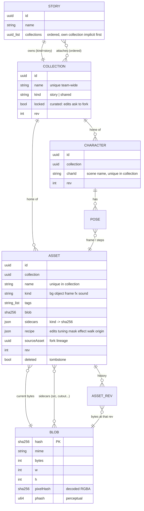
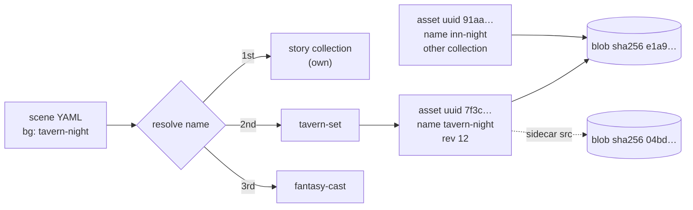
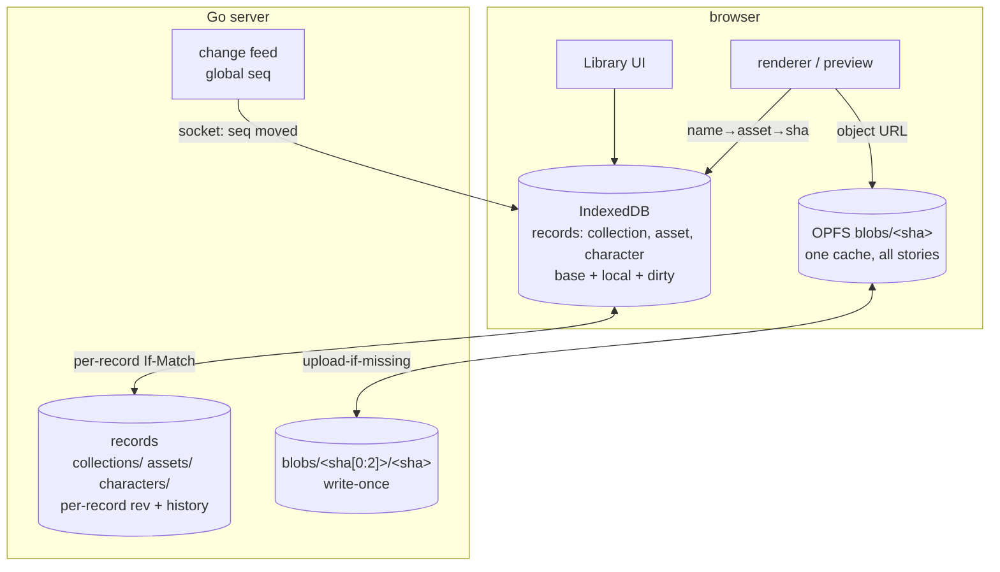

# Asset library 1/3 — architecture

Status: **shipped** (2026-09-28). Replaces per-story asset libraries. Demo service: no migration, rebuild by hand. UI summary: `../03-twinejs-asset-manager.md`.

Series:
1. **architecture** — data model, how collections relate to stories, library UI (this file)
2. `asset-library-2-sync.md` — sync protocol, sync UI, editing collections
3. `asset-library-3-export.md` — compiled stories served from shared blobs

## Why

Recon 2026-09-28. Every asset sync bug traces to one of these:

| Today | Effect |
|---|---|
| Identity = `hash + ownerCharacter` | Edit changes the key. Fast-forward is a guess from id+name+owner. |
| Blob stored by mutable id | `immutable` cache header lies. Stale writer overwrites newer bytes. |
| Whole-manifest PUT, If-Match optional | Two people touching different assets still conflict or clobber. |
| Hand-kept field whitelist (`AssetProvenance`) in 4 places | New field (effect, walk, mask) silently does not travel. |
| Base (`syncedHashes`) in memory only | Reload = server wins. Ping-pong guards everywhere. |
| One library per story, import copies bytes | Same picture N times. Sidecars lost on import. Name silently breaks on `reused`. |

## Assumptions

- One server = one team. Auth stays the one shared bearer token. Everyone can read and
  write everything. Per-user identity only for display (`by`, presence, locks).
- Several people, several stories, overlapping art.
- Scene YAML keeps plain names: `bg: tavern-night`.
- Editing art used by more than one story **asks**: update all or fork.

## Model

Three layers. Only the middle one is mutable.

| Layer | Key | Mutable | Holds |
|---|---|---|---|
| **Blob** | sha256 of bytes | never | image / sound bytes. Content only. No name. |
| **Asset** | uuid | yes, `rev` | name, kind, tags, current blob, sidecar blobs, edit recipe, walk, effect |
| **Collection** | uuid | yes, `rev` | name, description, flags. Owns assets and characters. |

Plus:
- **Character** — uuid, `rev`, lives in one collection, poses point at asset uuids.
- **Story** — existing record. Gains `collections: [uuid...]`, ordered.

Rules:
- An asset lives in exactly **one** collection (its home). No many-to-many item table.
  Reuse = attach the collection, not link the item. Keeps name lookup trivial.
- Name unique **within** a collection. Asset names and character ids share that namespace
  (same rule as today, narrower scope).
- Collection names unique team-wide. Needed for the qualified form `tavern-set/night`.
- Every story gets its own collection, `kind: story`, created with the story. Always
  first in its resolution order. Uploads from the story default there.
- Edit = new blob + asset points at it. Asset uuid never changes. Old blob kept for
  history.
- Pose images carry no public name. Reached through the character only. Out of the
  namespace.

### ER



Answer to "collection items by collection name → db entry of sha blobs": nearly. The
collection holds **asset records** by uuid, not blobs. The asset record holds the name and
points at a blob sha. The extra hop is what lets an edit keep the asset's identity and
lets two names share one blob for free.



Two names, one blob (right side): costs no bytes.

## Name resolution

- Order: story's own collection → attached collections in listed order.
- First hit wins. Same name further down = **shadowed**.
- `bg: tavern-set/night` = qualified, skips the order.
- Lint:
  - ambiguous name (two attached collections have it, not shadowed by own) → warning,
    suggest qualified form.
  - name found nowhere → error, as today.
- Shadowing is also how **fork** works: copy the asset into the story collection under the
  same name. YAML unchanged, story now sees its own copy.

## Dedup and the content → hash function

Three tiers, all on the blob record, computed client side on upload:

| Tier | Function | Catches | Action |
|---|---|---|---|
| exact | `sha256(bytes)` via `crypto.subtle` | same file | automatic. Store once. Ask: reuse existing asset or new name on same blob. |
| pixel | `sha256(w, h, decoded RGBA)` via OffscreenCanvas | same image re-encoded (png ↔ webp, metadata stripped) | suggest: "same picture as `tavern-night`" |
| perceptual | 64-bit dHash on 9×8 greyscale, Hamming ≤ 6 | resized, recompressed, slightly edited | show in Duplicates view only. Never automatic. |

- Storage key is always exact sha256. Pixel and perceptual are lookup indexes.
- Server stores all three, indexes pixel + phash, answers `POST /blobs/similar`.
- Sounds: exact tier only.

## Where things live



- Client blob cache is **global**, keyed by sha. A picture used by five stories is one file
  in OPFS too.
- Server: `DATA_DIR/blobs/ab/abcdef…` flat, write-once. `DATA_DIR/lib/collections/<uuid>.json`,
  `lib/assets/<uuid>.json` + `revs/`. Details in file 2.
- Per-story `assets/` dir and `assets.json` go away.

## Library UI

One dialog, replaces the Assets dialog and its Import tab.

```
┌ Library ────────────────────────────────────────────────────────────────┐
│ COLLECTIONS            │ tavern-set ▾  (shared · 42 assets · ☁ synced)    │
│                        │ [search……] [tags ▾] [kind ▾] [⚠ dupes 2] [+ add] │
│ ◧ Mine: Night Market   │ ┌──────┐ ┌──────┐ ┌──────┐ ┌──────┐ ┌──────┐     │
│ ── attached ──  ↕ drag │ │      │ │      │ │ ⑂    │ │      │ │ ✎Ana │     │
│ ☑ tavern-set           │ └──────┘ └──────┘ └──────┘ └──────┘ └──────┘     │
│ ☑ fantasy-cast         │  night    day      bar      door     stool       │
│ ── team ──             │  ●4       ●4       ●1       ●2       ●1          │
│ ☐ ui-icons             │                                                  │
│ ☐ forest-pack   🔒     │ ● = used in N stories   ⑂ shadowed here          │
│ ☐ Story: Old Mill      │ ✎Ana = Ana editing now  ⚠ conflict  ↑ pending    │
│ + New collection       │                                                  │
│ ⌕ All assets           │                                                  │
└─────────────────────────────────────────────────────────────────────────┘
```

- **Left rail**
  - `Mine` = the story's own collection. Always on top, not detachable.
  - `attached` = checkboxes. Drag to reorder = resolution order.
  - `team` = every collection on the server, including other stories' own collections.
    Tick = attach. **This is the dropdown/selector.**
  - 🔒 = locked (curated). Edits ask to fork.
  - `+ New collection` → name → empty shared collection, attached to this story.
  - `All assets` = search across everything, attached or not.
- **Grid**: same tiles and kind tabs as today (Backgrounds, Objects, Characters, FX, Sounds)
  as a filter row, not separate tabs.
- **Tile badges**: `●N` stories using it (click → list, incl. teammates' stories), `⑂`
  shadowed by story copy, live `✎name` editing lock, sync state.
- **Tile menu**: Edit, Rename, Move to collection…, Copy to Mine (fork), Show usages,
  Versions…, Delete.
- **Drag**
  - file onto grid → upload into the shown collection. Exact dupe → dialog (below).
  - tile onto a collection in the rail → move (Alt = copy).
  - tile onto stage → scene snippet, as today.
- **Scene editor autocomplete** lists names from the resolution order, grey for shadowed,
  and offers unattached team collections at the bottom: picking one attaches it.

Upload dupe dialog:

```
┌ Already in the library ─────────────────────────────┐
│ [img]  Same file as  tavern-set / tavern-night      │
│                                                     │
│  ( ) Use tavern-night  — attach tavern-set          │
│  (•) New name on the same image: [inn-night    ]    │
│  ( ) Upload anyway as separate asset                │
│                               [Cancel] [OK]         │
└─────────────────────────────────────────────────────┘
```

Pixel/perceptual match: same dialog, wording "Looks like…", default = new separate asset.

Duplicates view (⚠ button): groups by tier, side by side, **Merge** picks a survivor,
rewrites scene references in affected stories (preview list first), tombstones the rest.

## Answers

| Question | Answer |
|---|---|
| Blobs = actual content? | Yes. Bytes only, keyed by sha256, never change, never named. |
| Pull a collection from server via selector? | Yes. `team` section of the left rail. Tick = attach to this story; records and blobs sync down. |
| New collection on client → upload → others use it right away? | Yes. Create + upload writes records and blobs to the server immediately. Change feed pushes to every open client; appears in their `team` list within a second. Attach it and names resolve. |

## Out of scope here

- Per-user permissions. One team, one token.
- Migration. Rebuild demo stories' assets by hand.
- Sound-specific tooling beyond exact dedup.

## Shipped / deferred

| Shipped | |
|---|---|
| Model, resolution order, qualified names, ambiguous lint | engine + facade + story-map |
| Library dialog | rail (Mine / Attached / Team / New / All), grid, filter row, badges, tile menu |
| Dedup | upload dupe dialog (exact / pixel / dHash), Duplicates view with merge + preview |
| Autocomplete | `coll/name` for shadowed/ambiguous, team names at the bottom, pick attaches |
| Story rename / delete | own collection follows rename; delete tombstones binding, keeps collection |

| Deferred | Why |
|---|---|
| `✎name` editing-lock badge | presence focus is one per client; taking `lib:<id>` drops the passage lock |
| Merge rewriting other devices' stories | only local story text is editable; listed in the preview instead |
| Characters in non-Mine collections | tiles read-only-ish: edit/tags/delete need the collection in the story's view; new characters land in Mine |
| Rename collection rewrites `old/x` refs | not done; plain refs unaffected |
| Server `/blobs/similar` | client-side dHash only |
| `twine-cli` | still reads the old per-story manifest |

