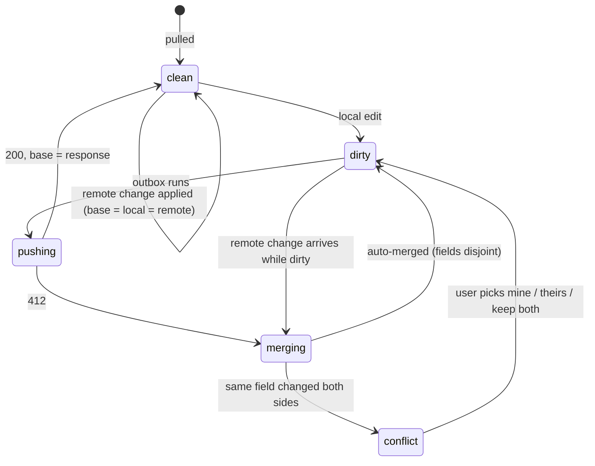
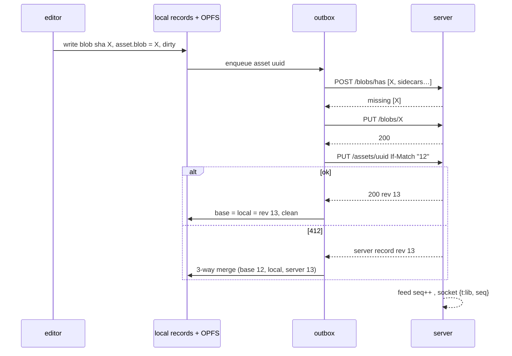
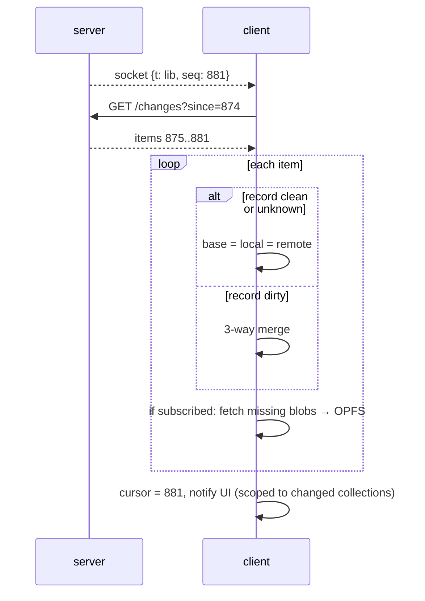
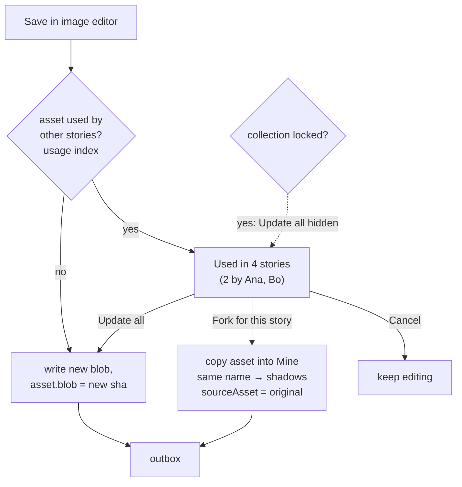

# Asset library 2/3 — sync, sync UI, editing collections

Status: plan. Model in `asset-library-1-architecture.md`.

## Principles

1. **Blobs cannot conflict.** Write-once, keyed by hash. Upload = "have it? no → PUT".
2. **Records sync one by one.** Collection, asset, character each carry `rev`. If-Match
   required. Two people on two assets never touch each other.
3. **Blob before record.** Server refuses a record naming a blob it lacks (`409
   blob-missing`). No `missing` state exists afterwards.
4. **Base persisted.** Client keeps last-synced copy of every record in IndexedDB.
   Reload changes nothing. 3-way merge possible.
5. **Remote writes never re-enter the outbox.** Kills ping-pong by construction, not by
   guards.
6. **One change feed.** Global `seq`. Socket only says "seq moved". Replaces count / bytes /
   assetRev signatures.
7. **Whole record syncs.** No field whitelist. New field = travels.

## Server

### Storage

```
DATA_DIR/
  blobs/ab/abcdef…            write-once, fsync + rename
  blobs/index.sqlite          hash → mime, bytes, w, h, pixelHash, phash, firstSeen
  lib/collections/<uuid>.json
  lib/assets/<uuid>.json
  lib/characters/<uuid>.json
  lib/revs/<uuid>/<rev>.json  full record per rev
  lib/feed.log                append-only: seq, type, id, rev, by, at
```

SQLite optional for the demo. A JSON index works to a few thousand blobs.

### Endpoints

All under `/api/v1`, bearer auth as today.

| Method | Path | Does |
|---|---|---|
| `POST` | `/blobs/has` | `{hashes[]}` → `{missing[]}` |
| `PUT` | `/blobs/{sha}` | body = bytes. Server hashes while streaming, 422 on mismatch. Exists → 200, no-op. |
| `GET` | `/blobs/{sha}` | bytes. `Cache-Control: private, max-age=31536000, immutable`. Now true. |
| `POST` | `/blobs/similar` | `{pixelHash, phash}` → matches with distance |
| `GET` | `/changes?since=<seq>&limit=500` | records changed after seq, full bodies. `{seq, items[], more}` |
| `GET` | `/collections` | all collection records (small) |
| `GET` | `/collections/{id}/items` | assets + characters of one collection + current seq |
| `PUT` | `/{type}/{uuid}` | create (`If-None-Match: *`) or update (`If-Match: "<rev>"`). 412 → body = server record. 409 → `name-taken` / `blob-missing` / `collection-missing`. |
| `DELETE` | `/{type}/{uuid}` | `If-Match`. Sets `deleted: true`, bumps rev. Tombstone stays in feed. |
| `GET` | `/{type}/{uuid}/revs` | history list: rev, by, at, blob |
| `GET` | `/usage?collection=<id>` | per asset: stories referencing it |

`{type}` ∈ `collections`, `assets`, `characters`.

### Server-side checks on record PUT

- rev matches (If-Match) — else 412 with current record.
- every sha in `blob` / `sidecars` exists — else 409 `blob-missing`.
- name unique in collection (assets + character ids) — else 409 `name-taken` + holder uuid.
- collection exists, not deleted.
- then: `rev+1`, write rev file, write record (tmp + rename), append feed, broadcast
  `{t: "lib", seq, type, id, rev, by}`.
- one mutex per library write. Demo scale, no contention worth sharding.

### Usage index

Server cannot parse scene YAML (Go vs TS parser). Client sends derived refs:

- Story PUT gains `assetRefs: [{collection, name}]`, resolved by the editor at save time.
- Server keeps `usage[assetUuid] = [storyId…]`, rebuilt from those on each story write.
- Feeds `●N` badges and the fork/update-all prompt, including stories nobody has open.
- Stale if the story was saved offline by an old client. Acceptable: badge is advisory.

### GC

- Blob live if named by any asset record, any asset rev, any published build (file 3).
- Janitor: mark from those, sweep unmarked blobs older than 7 days.
- Rev pruning: keep last 50 revs per asset + all revs referenced by a story revision.

## Client

### Local stores

| Store | Where | Holds |
|---|---|---|
| `records` | IndexedDB | `{id, type, base, local, dirty, conflict?}`. `base` = last agreed server copy incl. rev. |
| `blobs` | OPFS `blobs/<sha>` | bytes, global cache |
| `outbox` | IndexedDB | ordered record ids with `dirty`. Survives reload. |
| `cursor` | IndexedDB | last applied `seq` |
| `subscribed` | IndexedDB | collection ids to keep full copies of (= attached to any local story + pinned) |

Unsubscribed collections: record list only (for the rail and search). Blobs fetched lazily
on view.

### Record state machine



### Push



- Outbox drains on: edit + 1 s debounce, reconnect, app start.
- Serial per record, parallel across records (max 4).
- Offline: outbox waits. UI shows `↑N pending`.

### Pull



- Socket down → poll `/changes` every 30 s. Same code path.
- Applied remote changes are tagged `source: remote`, never enqueued.
- UI change event carries collection ids. Only affected dialogs re-render. Fixes today's
  unscoped `refreshAssetLibrary`.

### 3-way merge

Per top-level field, `base` vs `local` vs `remote`:

| base→local | base→remote | Result |
|---|---|---|
| same | changed | take remote |
| changed | same | keep local |
| changed | changed, equal | take either |
| changed | changed, differ | **conflict** on that field |

- `recipe` merged per key (`edits`, `mask`, `effect`, `walk` …), not as one blob.
- `tags` merged as sets (add/remove both sides).
- `blob` conflict (both repainted) → conflict UI. Options: mine, theirs, **keep both** (mine
  becomes new asset `name-2` in same collection, pointing at my blob).
- `name` conflict → conflict UI.
- Remote `deleted` vs local edit → prompt: restore with my edit / accept delete.

### Name-taken on create

Two people add `stool` to the same collection offline.
- Second PUT → 409 `name-taken`.
- Client renames to `stool-2`, retries, toasts "`stool` taken by Ana's upload — saved as
  `stool-2`" with Rename / Replace hers buttons.

## Editing shared art

Image editor Save:



- Prompt lists the affected stories with owners (from usage index `by`).
- "Update all" on a locked collection hidden; only fork.
- Fork keeps the name, lands in the story's own collection, shadows the shared one. Scene
  YAML untouched.
- Tile in `Mine` shows `⑂ forked from tavern-set/night`. Menu: **Unfork** (delete the copy,
  shared one shows again), **Push my version to tavern-set** (= update all, same prompt).
- Same prompt for Rename (rename breaks other stories' YAML — "Update all" also
  rewrites references in those stories, previewed) and Delete.
- Editing lock: opening the image editor takes the existing advisory websocket lock on the
  asset uuid. Others see `✎Ana` on the tile and a read-only banner, "Edit anyway" allowed
  (merge handles it).

## Editing collections

| Action | Where | Rules |
|---|---|---|
| Create | rail `+ New collection` | name unique team-wide. Auto-attached to current story. |
| Rename | rail item menu | qualified refs `old/x` rewritten in using stories, previewed. Plain refs unaffected. |
| Describe, lock/unlock | collection header | lock = curated set. Only affects the editor prompt, not the server. |
| Attach / detach | rail checkbox | detach warns if the story references names only found there. |
| Reorder | rail drag | changes resolution order. Lint re-runs; shadow changes listed. |
| Move asset | tile menu / drag to rail | changes `collection` field. Name clash in target → prompt. Stories that lose access (did not attach target) listed; offer to attach. |
| Copy asset | Alt-drag / "Copy to…" | new uuid, same blob, `sourceAsset` set. Zero bytes. |
| Delete collection | rail item menu | refused while attached to any story (list shown). Else tombstone + all its records. |
| Promote story art | select tiles in Mine → "Move to collection…" | the usual way shared sets are born. |
| Versions | tile menu → Versions… | rev list with thumbnails, by, at. Restore = new rev pointing at old blob. |

## Sync UI

**Library header** — one status chip per shown collection:

| Chip | Meaning |
|---|---|
| `☁ synced` | outbox empty, cursor current |
| `↑3` | 3 records pending |
| `↓` | pulling blobs |
| `⚠ 1 conflict` | click → conflict panel |
| `⦸ offline` | socket + poll failing, edits queue locally |

**App-wide**: same chip in the story library top bar, aggregated.

**Tile**: `↑` pending, `⚠` conflict, `✎name` locked by someone, spinner while blob
downloads.

**Conflict panel**:

```
┌ Conflict: tavern-set / tavern-night ────────────────────────────────┐
│  Base (rev 12)         Mine                 Ana's (rev 13)          │
│  [img]                 [img]                [img]                   │
│  effect: none          effect: glitch       effect: none            │
│  tags: bar, night      tags: bar, night     tags: bar, night, wet   │ ← auto-merged
│                                                                     │
│  Pixels:  ( ) mine  ( ) Ana's  (•) keep both → mine as tavern-night-2│
│  Effect:  (•) mine  ( ) Ana's                                        │
│                                                  [Resolve]          │
└─────────────────────────────────────────────────────────────────────┘
```

**Activity feed** (collection header → "Activity"): last 50 feed items for this collection.
`Ana replaced tavern-night · 2 min · [view] [revert]`. Reads `/changes` filtered client side.

**Toasts** only for: name-taken rename, remote delete of something open, conflict created.
Everything else silent.

## What goes away

- `asset-sync.ts`, `pull-assets.ts`, `checkout-story.ts` fast-forward / provenance compare.
- `AssetProvenance`, `landingFor`, `applySyncedProvenance`, `SIDECAR_SYNC`.
- `syncedHashes`, `assetFingerprints`, `assetPullRevs`, `assetSignatures` refs.
- Manifest PUT, `/assets/diff`, per-story `assets/`, `assetRev`, `missing`.
- Bundle-import rules reused as sync rules.

## Tests that must exist

- Two clients, same asset, disjoint fields → both survive, no prompt.
- Two clients repaint same asset → conflict, keep both works.
- Reload mid-outbox → push completes after reload.
- Pull applies N changes → zero outbound requests.
- Record PUT with unknown blob → 409, client uploads blob and retries.
- Offline create same name ×2 → second becomes `-2`.
- Fork → YAML unchanged, story renders fork, other story renders original.
- Unfork → original shows again.
