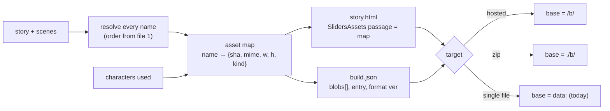
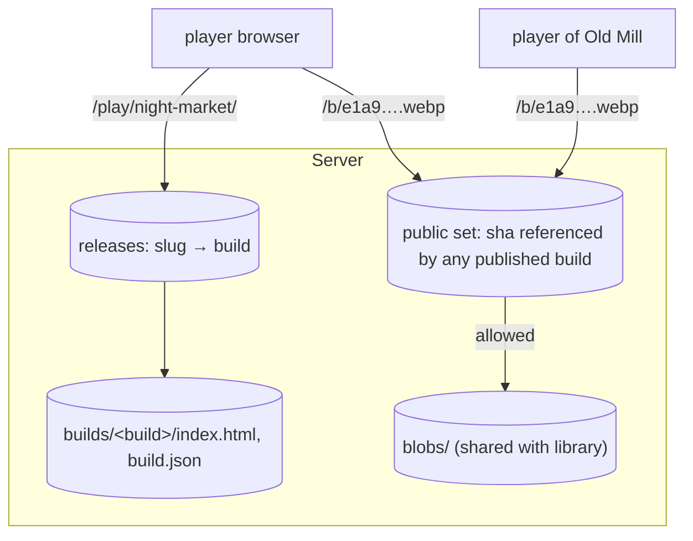
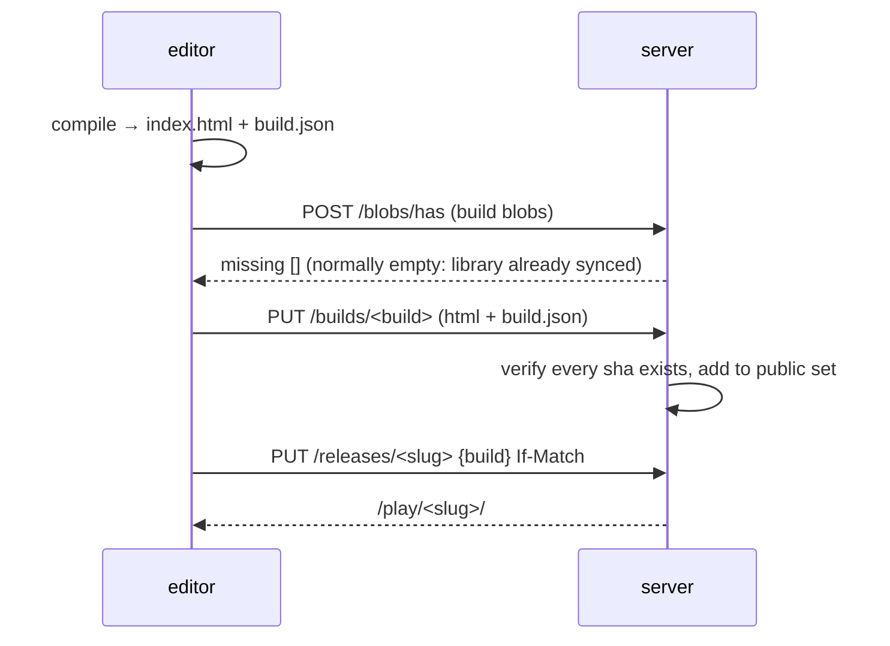

# Asset library 3/3 — export and hosted builds

Status: plan. Model in `asset-library-1-architecture.md`, sync in `asset-library-2-sync.md`.

## Goal

Later: compiled stories hosted on our backend. Many stories, one blob store. Same image
in five stories = one URL, one download, one browser cache entry.

Today: publish inlines every asset as `data:` base64 into `story.html`
(`src/store/use-publishing.ts:108`). No sharing, huge HTML, no caching.

## Terms

| Term | What | Mutable |
|---|---|---|
| **Library** | collections, assets, blobs (files 1–2) | yes |
| **Build** | one compiled snapshot of one story | never |
| **Release** | named pointer `story → build` (`latest`, `v3`) | yes |
| **Bundle** | `.sliders.zip` for editing / moving between servers | n/a |

A build pins **blob hashes**, not asset records. Editing the library never changes a
published story until republish.

## Compile



- One compiler, three targets. Only the URL base differs.
- `SlidersAssets` passage holds `name → sha` (+ `id → sha` for poses), not URLs. Runtime
  builds URLs as `base + sha + ext`. Base is one constant in the HTML.
- Resolution happens at compile time. Player never sees collections.
- Unresolved names → compile error listing them (same lint as editor).
- Includes: referenced assets + every pose of referenced characters + sidecars the player
  needs (none today; `cutout` is baked). `src` never shipped.

`build.json`:

```json
{
  "build": "b_2026-09-28_7c1e",
  "story": "<story uuid>",
  "storyRev": 214,
  "format": "sliders 0.4.2",
  "createdAt": "2026-09-28T14:02:11Z",
  "by": "ana",
  "entry": "index.html",
  "blobs": [
    {"sha": "e1a9…", "mime": "image/webp", "bytes": 81233, "w": 1920, "h": 1080,
     "firstPassage": "Tavern"}
  ]
}
```

`firstPassage` feeds preload order.

## Hosted layout

```
GET /play/<story-slug>/                 → 302 to current release build
GET /play/<story-slug>/<build>/         → index.html   (immutable)
GET /play/<story-slug>/<build>/build.json
GET /b/<sha>.<ext>                      → blob bytes   (immutable, public)
```



- `/b/` serves the **same** blob files the library uses. No copy.
- Public only if the sha appears in some published build's `blobs`. Unpublished art stays
  behind auth. Server keeps a `public` set, rebuilt on publish/unpublish.
- Headers on `/b/`: `Cache-Control: public, max-age=31536000, immutable`, `ETag: "<sha>"`,
  CORS `*`. Safe because the sha is the content.
- `.ext` in the URL only for content-type sniffing by CDNs and people saving the image.
  Server ignores it, uses stored mime.
- Cross-story cache hit is automatic: two stories, same sha, same URL.
- CDN later: put Cloudflare in front of `/b/` and `/play/*/<build>/`. Nothing to purge,
  ever. Only `/play/<slug>/` (the redirect) is short-cache.

## Publish flow



| Method | Path | Does |
|---|---|---|
| `PUT` | `/api/v1/builds/{build}` | multipart: `index.html`, `build.json`. 409 if a sha is missing. Write-once. |
| `GET` | `/api/v1/builds?story=<id>` | builds of a story |
| `PUT` | `/api/v1/releases/{slug}` | `{build}`, If-Match. Rollback = point at an older build. |
| `DELETE` | `/api/v1/releases/{slug}` | unpublish. Blobs leave the public set if no other build needs them. |

Build could be compiled server side later (twine-cli in Node on the box). Client compile
first: the compiler already lives in the editor.

## Player runtime

- Reads `SlidersAssets` map + base constant.
- `url(name) = base + sha + ext`. Renderer resolver swap only (`createNamedResolver` path).
- Preload: on passage enter, prefetch blobs whose `firstPassage` is a link target of the
  current passage. `<link rel=preload as=image>`.
- Optional service worker: cache `/b/*` by URL forever. Makes a played story work offline
  and shares the cache across stories on the same origin.
- `data:` target keeps working for single-file export, itch.io etc.

## Zip export (playable offline)

```
night-market.zip
  index.html          base = "./b/"
  build.json
  b/e1a9….webp
  b/04bd….png
```

Same bytes as hosted. Unzip anywhere, open `index.html`. Some browsers block `file://`
fetch for `` — plain `` works, so no fetch needed for images.

## Editing bundle (`.sliders.zip`) — revised

For moving a story + its art between servers, or backup. Not playable.

```
story.sliders.zip
  story.json
  collections.json      collections the story owns or attaches (records)
  assets.json           asset + character records of those collections, or referenced only
  blobs/<sha>           current + sidecar blobs (incl. src)
```

- Import is idempotent:
  - blob known → skip.
  - record uuid known → take the higher rev, else conflict panel (file 2).
  - record new → create. `name-taken` → number, report.
- Records keep their uuids across servers, so re-importing an updated bundle updates in
  place rather than duplicating. Fixes today's silent `reused` name break.
- Option at export: "whole attached collections" vs "only what the story uses".

## Retention

- Build is immutable, kept until deleted.
- Blob GC (file 2) treats every build's `blobs` as roots.
- Deleting a build: allowed if no release points at it.
- Server keeps last 10 builds per story by default, releases pin theirs.

## Later, not now

- Derived variants: `/b/<sha>@w1280.webp`, `@thumb`. Generated on demand, cached as their
  own blobs with a `derivedFrom` index. Build picks variant per viewport via `srcset`.
- Per-story access control on `/play/` (private link tokens). Blobs would then need signed
  URLs; the public set model covers the public case only.
- Stats: plays per build.
